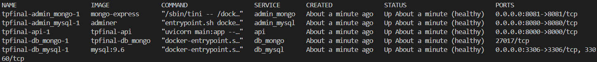
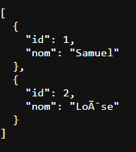

# 🚀 TP Final Conteneurisation - API Hybride (MySQL & MongoDB)

## 📝 Présentation du Projet
Ce projet déploie une architecture micro-services résiliente via **Docker Compose**. Il met en place une API développée avec **FastAPI** (Python) capable de communiquer simultanément avec deux types de bases de données :
* **MySQL** : Pour la gestion des données relationnelles.
* **MongoDB** : Pour le stockage de documents NoSQL.

Le projet inclut également les interfaces web d'administration pour chaque base de données.

---

## 📂 Arborescence du Projet

L'arborescence du projet est structurée de la manière suivante :
```text
.
├── api/
│   ├── .dockerignore
│   ├── Dockerfile
│   ├── main.py
│   └── requirements.txt
├── mongo/
│   ├── init-scripts/
│   │   └── init.js
│   └── Dockerfile
├── screen/
│   ├── compose-ps.png
│   ├── page-posts.png
│   └── page-users.png
├── sqlfiles/
│   └── migration-v001.sql
├── .env                  # Fichier des variables d'environnement (non versionné)
├── .env.example          # Modèle de variables d'environnement
├── .gitignore
├── docker-compose.yml    # Fichier d'orchestration
└── README.md
```

---

## ⚙️ Déploiement et Utilisation

### 1. Prérequis
* Avoir **Docker** et **Docker Compose** installés.
* Créer le fichier des variables d'environnement à la racine :
  ```bash
  cp .env.example .env
  ```
  *(Remplissez les valeurs nécessaires dans le fichier `.env` nouvellement créé).*

### 2. Lancement des services
Pour construire les images personnalisées et démarrer l'infrastructure en arrière-plan :
```bash
docker compose up --build -d
```

### 3. Accès aux Services
Une fois les conteneurs démarrés et le statut `(healthy)` atteint, les services sont accessibles sur :
* **API FastAPI** : `http://localhost:8000` (Routes : `/users`, `/posts`, `/health`)
* **Adminer (MySQL)** : `http://localhost:8080`
* **Mongo-Express** : `http://localhost:8081`

---

## 🛡️ Points Techniques & Respect du Barème

Ce projet a été conçu pour respecter strictement les consignes de sécurité et d'orchestration :

1. **Orchestration Stricte (`depends_on`)** : L'API et les interfaces d'administration ne démarrent que lorsque les bases de données sont pleinement opérationnelles (`condition: service_healthy`).
2. **Healthchecks Métiers (5/5 Healthy)** : 
   * Validation par requête SQL sur MySQL (`SELECT 1 FROM utilisateurs...`).
   * Validation du nombre de documents MongoDB via `mongosh`.
   * **Mongo-Express** : Test HTTP sécurisé avec intégration de variables d'environnement masquées (`$$ME_CONFIG_BASICAUTH_USERNAME`) pour ne pas exposer de mots de passe en clair dans le compose.
3. **Haute Disponibilité** : Tous les services utilisent la politique `restart: on-failure`.
4. **Sécurité** : Aucun mot de passe n'est écrit en dur. Tout est injecté via le fichier `.env`. L'image MongoDB est construite sur mesure pour s'exécuter avec un utilisateur non-root.
5. **Persistance** : Les données sont sauvegardées sur des volumes Docker (`mysql_data`, `mongo_data`).

---

## 📸 Captures d'écran de validation

Les preuves de fonctionnement sont disponibles dans le dossier `screen/` :

### 1. Statut "Healthy" des 5 services
Preuve que l'orchestration et les healthchecks sont valides :


### 2. Validation de la route MySQL (Port 8000)
L'API récupère bien les données initialisées par le script `migration-v001.sql` :


### 3. Validation de la route MongoDB (Port 8000)
L'API récupère bien les documents insérés par le script `init.js` :


---
*Projet réalisé dans le cadre du module de Conteneurisation.*